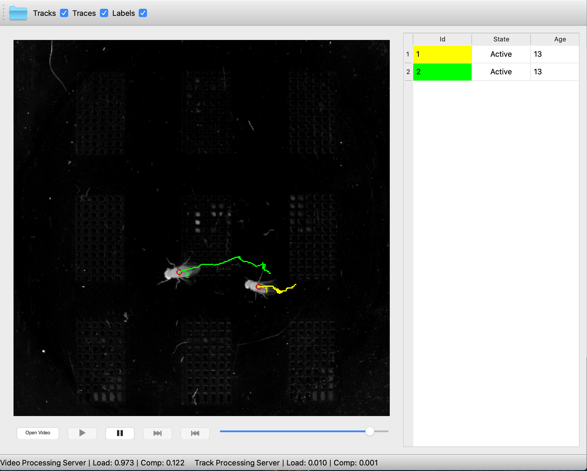

Interview Question (Serkan ISCI)
=========================================

|

This application is developed for the purpose of interview question of the Research Software Engineer position in the
Murthy Lab at Princeton University.

Task A: Build s server that can interactively perform model inference.

- I have developed the computation module for parallel processing. This module using ZeroMQ for messaging between processes. VideoProcessingServer and TrackProcessingServer implemented in the context of this module.

- The application is developed using PySide2 library and it supports user interactions like video seeking.

- Heatmaps are processed to extract peaks using local peak finding and displayed at the user interface.

Task B: Implement a multi-object tracker to assign the predicted centroids to the correct animal over time.

- Kalman Filter is used to track detections and these detections assigned to the objects over time with label and trace information.

- VideoProcessing (inference + peak finding) and TrackProcessing statistics calculated and displayed at the status bar in realtime.

- Tracking algorithm implemented in parallel.

Installation and Setup
=========================================

